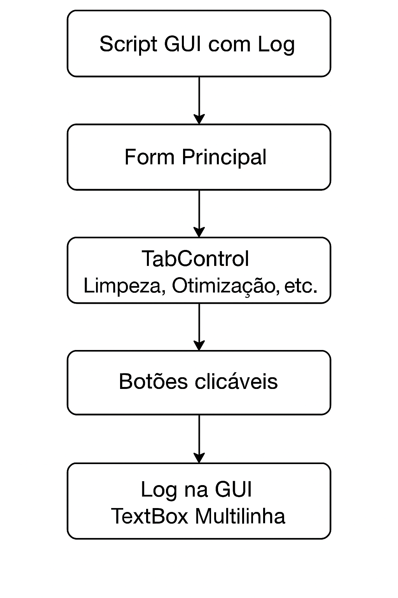

# Assistente de Manutenção de Sistema Windows para Suporte Técnico

Este script PowerShell foi desenvolvido para facilitar tarefas de manutenção em sistemas Windows, incluindo limpeza, otimização, monitoramento e reparo. 
Ele oferece **uma interface interativa via terminal** ou **GUI com log**, com opções organizadas por categoria e subtipo.

## 🧠 Lógica e Autoria

A lógica de funcionamento, estrutura de decisão, construção textual e organização funcional foram idealizadas por **Rafael Martiniano**.  
- A versão **sem interface gráfica** foi refinada com auxílio da **IA Copilot da Microsoft**.  
- A versão **com interface gráfica e log** foi desenvolvida com suporte da **IA ChatGPT**, responsável pela criação da GUI e integração das funções existentes.

## 🛠️ Funcionalidades

- Limpeza básica e avançada
- Otimização de rede, vídeo, som, WMI e busca
- Monitoramento de processos, rede e dispositivos
- Reparo de componentes nativos, aplicativos da loja e programas MSI
- Interface gráfica opcional com log em tempo real

## 💻 Aplicações Utilizadas

- [Microsoft Copilot](https://copilot.microsoft.com) — Assistente na versão sem GUI
- [ChatGPT](https://chat.openai.com) — Assistente na versão com GUI
- [Visual Studio Code](https://code.visualstudio.com) — Ambiente de edição
- [PowerShell ISE](https://learn.microsoft.com/powershell/scripting/windows-powershell/ise/introducing-the-windows-powershell-ise) — Execução e testes

## 📦 Requisitos

- Windows 10 ou superior
- Permissões administrativas
- PowerShell 5.1+

## 🔄 Comparativo: Console x GUI

| Aspecto                | Script Console | Script GUI com Log        |
|------------------------|----------------|---------------------------|
| Entrada do usuário     | Digita números | Botões clicáveis nas abas |
| Saída / Feedback       | Console + GUI  | TextBox multilinha na GUI |
| Visualizar  resultados | Console        | Mensagens visíveis na GUI |
| Execução das funções   | Switch + função| Botões com funções na GUI |
| Navegação / Menu       | Sequência linear| Abas, botões e navegação |
| Interação do usuário   | Digitar números | Botões com resposta      |
| Manutenção / Expansão  | Opções c/ switch| Adicionar abas e botões  |

## 🖼️ Diagramas do fluxo do script

Veja como o usuário interage com o script e como as funções são chamadas:

  
*Obs: o diagrama mostra como cada função é chamada e os logs são exibidos na interface.*

## 📄 Licença

© Microsoft Corporation. Este projeto utiliza ferramentas da Microsoft e respeita suas diretrizes de uso.
OpenAI © 2015–2025. Este projeto utiliza ferramentas do ChatGPT e respeita suas diretrizes de uso.
© Rafael Martiniano. Todos os direitos reservados.
